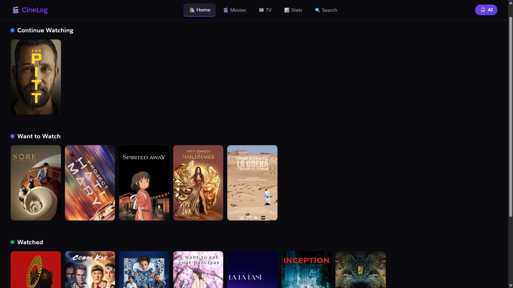
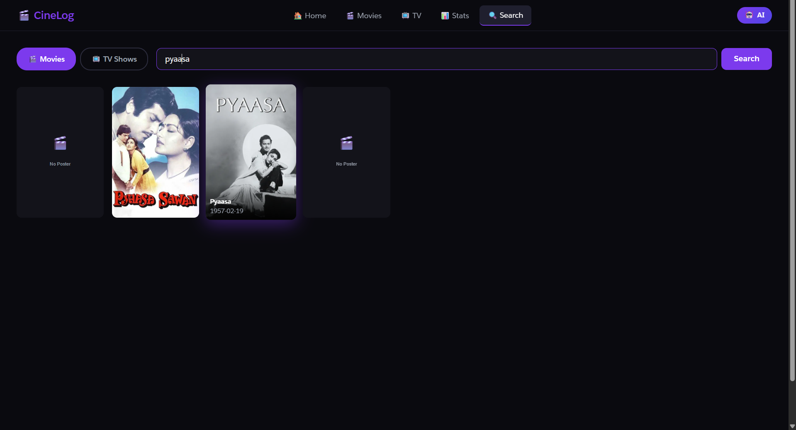
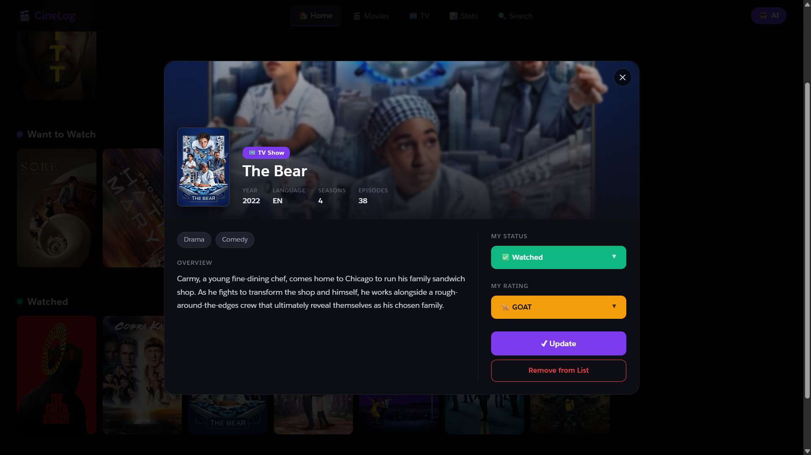
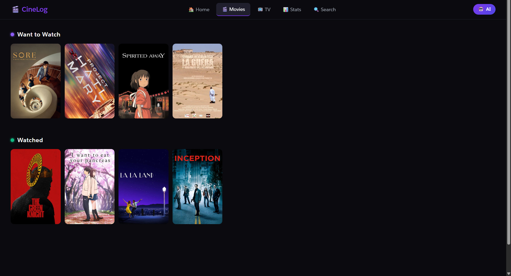
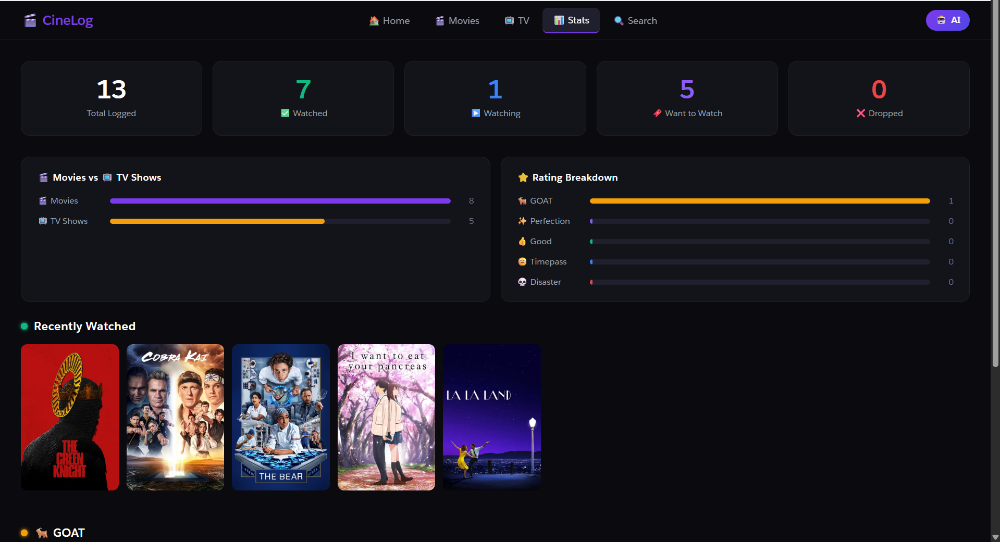
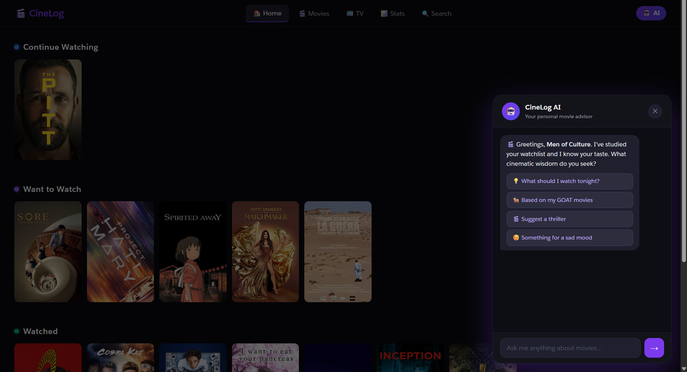
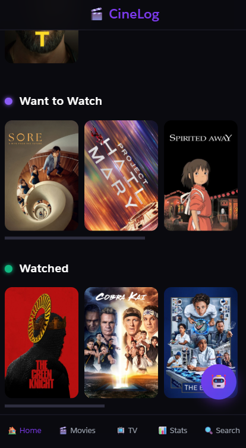
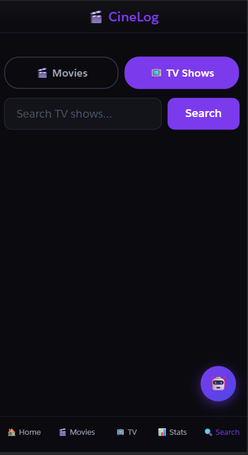
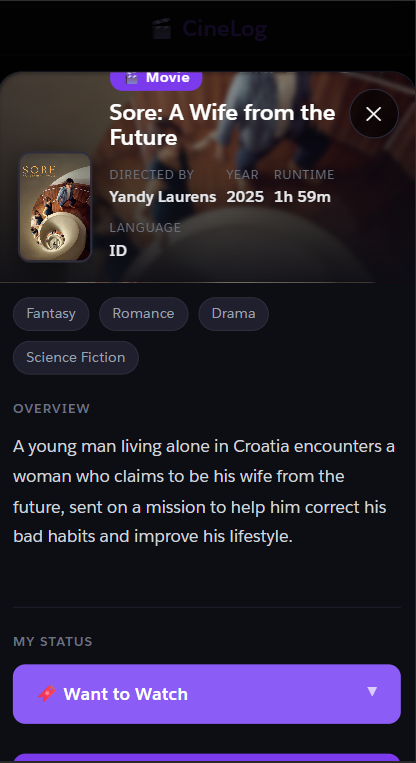
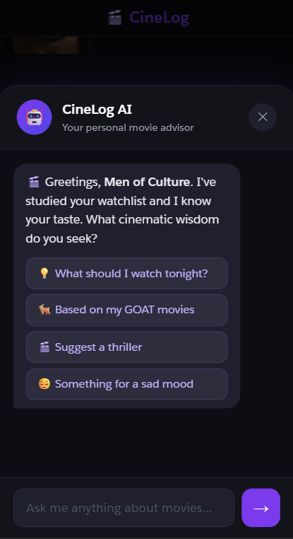

# CineLog

> A personal movie & TV tracker built entirely on Salesforce — search, rate, and get AI-powered recommendations tailored to your taste.



[](https://developer.salesforce.com)
[](https://developer.salesforce.com/docs/atlas.en-us.apexcode.meta/apexcode/)
[](https://www.themoviedb.org/)
[](https://ai.google.dev/)
[](https://www.salesforce.com/products/experience-cloud/overview/)

---

## What is CineLog?

Most movie tracking apps do the bare minimum — add a title, give it stars, move on. CineLog is different.

It's a full-stack Salesforce application that pulls live data from The Movie Database (TMDB), lets you build a personal watchlist with a rating system that actually captures how you *feel* about a film, and gives you an AI advisor that reads your entire watch history to recommend what to watch next.

Built as a portfolio project to demonstrate real-world Salesforce development — REST API integration, Lightning Web Components, Apex backend logic, Experience Cloud deployment, and mobile-first design — all in one cohesive app.

---

## Screenshots

<table>
  <tr>
    <td><strong>Home — Shelf View</strong></td>
    <td><strong>Search</strong></td>
  </tr>
  <tr>
    <td></td>
    <td></td>
  </tr>
  <tr>
    <td><strong>Movie Detail Card</strong></td>
    <td><strong>Movies Tab</strong></td>
  </tr>
  <tr>
    <td></td>
    <td></td>
  </tr>
  <tr>
    <td><strong>Dashboard</strong></td>
    <td><strong>AI Chat Advisor</strong></td>
  </tr>
  <tr>
    <td></td>
    <td></td>
  </tr>
</table>

### Mobile

<table>
  <tr>
    <td><strong>Home</strong></td>
    <td><strong>Search</strong></td>
    <td><strong>Detail Card</strong></td>
    <td><strong>AI Chat</strong></td>
  </tr>
  <tr>
    <td></td>
    <td></td>
    <td></td>
    <td></td>
  </tr>
</table>

---

## Features

### Core
| Feature | Description |
|---|---|
| Search | Live search for movies and TV shows via TMDB API with poster grid results |
| Watchlist | Save titles to a personal library with status — Watching, Want to Watch, Watched, Dropped |
| Detail Card | Full movie info — director, cast, runtime, language, genres, overview — fetched live from TMDB |
| Shelf View | Netflix-style horizontal shelves organised by status, latest entries first |
| Personality Ratings | Rate with GOAT, Perfection, Good, Timepass, or Disaster — because star ratings miss the point |
| Multi-user | Each user's data is fully isolated — OwnerId scoping on all queries |

### AI
| Feature | Description |
|---|---|
| AI Chat Advisor | Powered by Gemini 2.5 Flash — reads your full watchlist and taste profile |
| Personalised Suggestions | Ask for recommendations by mood, genre, director, language, or vibe |
| Context Aware | The AI knows your GOAT-rated films and tailors every response accordingly |

### Technical
| Feature | Description |
|---|---|
| REST API Integration | Outbound callouts to TMDB and Gemini via Salesforce Named Credentials |
| Custom Metadata Config | API keys and endpoints stored in `CineLog_Config__mdt` — no hardcoding |
| Mobile Responsive | Bottom tab navigation, slide-up modals, fully functional on phone |
| Experience Cloud | Deployed as a public Salesforce Experience Cloud site |

---

## Tech Stack

| Technology | Purpose | Notes |
|---|---|---|
| Salesforce LWC | Frontend UI components | HTML, JS, CSS |
| Apex | Backend business logic | REST callouts, SOQL, DML |
| SOQL | Database queries | OwnerId-scoped, optimised |
| Experience Cloud | Public site hosting | LWR framework |
| TMDB API | Movie & TV show data | Search, details, credits |
| Google Gemini 2.5 Flash | AI chat responses | Contextual, personalised |
| Named Credentials | Secure API authentication | No keys in code |
| Custom Metadata Types | App configuration | Environment-agnostic |

---

## Architecture

```
┌─────────────────────────────────────────────────────┐
│                  Experience Cloud Site               │
│                  (LWR Framework)                     │
├─────────────────────────────────────────────────────┤
│  Lightning Web Components                            │
│  ├── cineLog            Main app shell & navigation  │
│  ├── cineLogModal       Movie detail card modal      │
│  └── cineLogAIChat      AI chat panel                │
├─────────────────────────────────────────────────────┤
│  Apex Layer                                          │
│  ├── CineLog_Controller     @AuraEnabled methods     │
│  ├── CineLog_TMDBService    TMDB API callouts        │
│  ├── CineLog_GeminiService  Gemini AI callouts       │
│  └── CineLog_ConfigHelper   Metadata config reader  │
├─────────────────────────────────────────────────────┤
│  Salesforce Platform                                 │
│  ├── Movie__c               Custom object           │
│  ├── CineLog_Config__mdt    Custom metadata type    │
│  ├── Named Credentials      Secure API endpoints    │
│  └── Remote Site Settings   Whitelisted domains     │
├──────────────────┬──────────────────────────────────┤
│   TMDB API       │   Google Gemini 2.5 Flash        │
│   (Movie data)   │   (AI responses)                 │
└──────────────────┴──────────────────────────────────┘
```

---

## Data Model

`Movie__c` — the core object that stores everything:

| Field | Type | Purpose |
|---|---|---|
| `Title__c` | Text | Movie or show title |
| `TMDB_ID__c` | Number | Unique TMDB identifier |
| `Type__c` | Picklist | Movie or TV Show |
| `Status__c` | Picklist | Watching / Want to Watch / Watched / Dropped |
| `My_Rating__c` | Picklist | GOAT / Perfection / Good / Timepass / Disaster |
| `Overview__c` | Long Text | Plot summary |
| `Genres__c` | Text | Comma-separated genre names |
| `Director__c` | Text | Director or show creator |
| `Cast__c` | Long Text | Top 5 cast members |
| `Runtime__c` | Number | Runtime in minutes |
| `Poster_URL__c` | URL | TMDB poster image URL |
| `TMDB_Rating__c` | Decimal | TMDB public rating |
| `Release_Date__c` | Date | Original release date |

---

## Project Structure

```
force-app/main/default/
├── classes/
│   ├── CineLog_ConfigHelper.cls       Reads API config from custom metadata
│   ├── CineLog_TMDBService.cls        All TMDB API callouts
│   ├── CineLog_GeminiService.cls      Gemini AI chat callouts
│   └── CineLog_Controller.cls         Main @AuraEnabled controller
├── lwc/
│   ├── cineLog/                       App shell, navigation, shelves
│   ├── cineLogModal/                  Movie detail card modal
│   └── cineLogAIChat/                 AI chat panel
└── objects/
    └── Movie__c/                      Custom object + all fields
```

---

## Local Setup

### Prerequisites
- Salesforce Developer Org ([sign up free](https://developer.salesforce.com/signup))
- Salesforce CLI (`npm install -g @salesforce/cli`)
- VS Code + Salesforce Extension Pack
- TMDB API key ([get one free](https://www.themoviedb.org/settings/api))
- Google Gemini API key ([get one free](https://aistudio.google.com))

### Steps

**1. Clone the repository**
```bash
git clone https://github.com/vaivaswatmanu/CineLog.git
cd CineLog
```

**2. Authorise your Salesforce org**
```bash
sf org login web -a CineLogOrg
sf config set target-org CineLogOrg
```

**3. Deploy to your org**
```bash
sf project deploy start
```

**4. Configure Remote Site Settings**

In Setup → Remote Site Settings, add:
- `https://api.themoviedb.org`
- `https://generativelanguage.googleapis.com`
- `https://image.tmdb.org`

**5. Create Named Credentials**

In Setup → Named Credentials, create:
- `TMDB_API` → URL: `https://api.themoviedb.org/3` → No Auth
- `Gemini_API` → URL: `https://generativelanguage.googleapis.com` → No Auth

**6. Create Custom Metadata record**

In Setup → Custom Metadata Types → CineLog Config → Manage Records → New:
- `TMDB_API_Key__c` → your TMDB API key
- `Gemini_API_Key__c` → your Gemini API key
- `TMDB_Base_URL__c` → `https://api.themoviedb.org/3`
- `Gemini_Base_URL__c` → `https://generativelanguage.googleapis.com/v1beta/models/gemini-2.5-flash:generateContent`

**7. Set up Experience Cloud**

- Enable Digital Experiences in Setup
- Create a new LWR site
- Add the `cineLog` component to the home page
- Activate and publish

**8. Open the app**
```bash
sf org open
```

---

## What I Learned

This project pushed me well beyond standard Salesforce tutorials. A few things that stood out:

**REST API integration in Apex is deceptively nuanced.** Handling serialisation of nested JSON, managing callout timeouts, and dealing with inconsistent TMDB response shapes across movie vs TV endpoints required careful defensive coding that you don't see in beginner resources.

**LWC has real architectural constraints.** The parent-child event communication model, the limitation of `cacheable=true` blocking callouts, and CSP restrictions on external images all required solutions I had to figure out from scratch.

**Mobile responsiveness on Experience Cloud is non-trivial.** The platform adds its own layout wrapper and padding that fights against fixed positioning. Getting the bottom tab bar and slide-up modals working correctly on real devices took significantly more effort than on a standard web app.

**AI integration is only as good as the context you provide.** The Gemini chat became genuinely useful only after I passed the user's full watchlist and custom rating system as context. Without that, it gave generic responses indistinguishable from a basic ChatGPT prompt.

---

## Author

**Vaivaswat Manu**

[](https://github.com/vaivaswatmanu)
[]

---

*Built with Salesforce Developer Edition — free tier, zero infrastructure cost.*